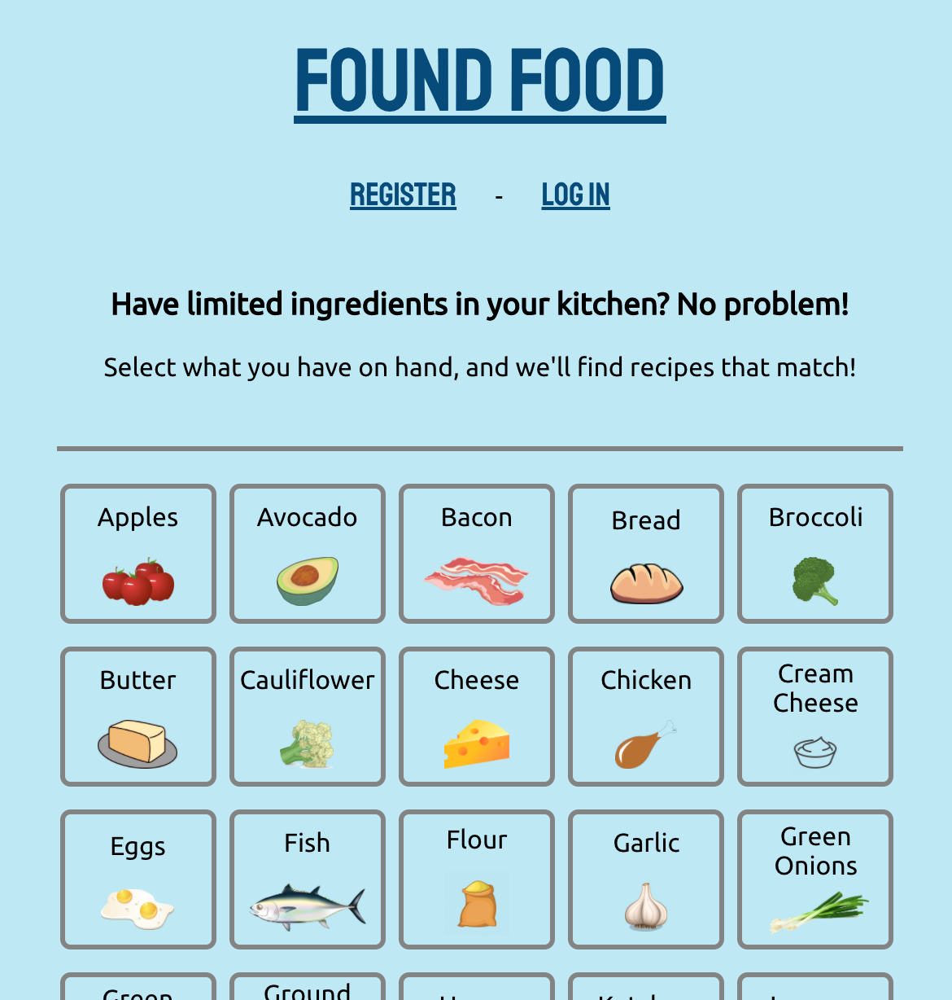
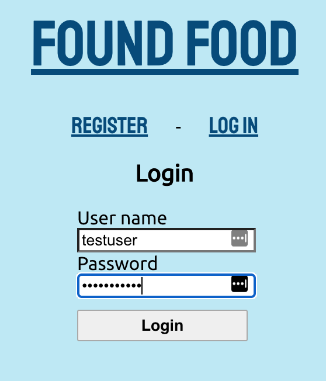

# [Found Food](https://found-food.vercel.app/)

## A recipe search app

Description:

Search for recipes based off of food you already have in your kitchen!

Login with test user to view saved recipes:

- Username: testuser
- Password: Testing123!

https://found-food.vercel.app/

### API Documentation

Github Repo: https://github.com/conorkenahan/found-food-api
Endpoint: https://fierce-gorge-10947.herokuapp.com/api

Two tables are required- users and saved_recipes.

- To create a user, you must sent the API a username and password.
- To save a recipe, you must send a recipeid, title, image, url and username.

### Screenshots

- Select the ingredients you have on hand from a list...

  

- View a list of compatible recipes!

  

- Register and login to save your favorite recipes.

  
  

- View your saved recipes when logged in.

  

### Technology used

- React
- Express
- Node & Postgres
