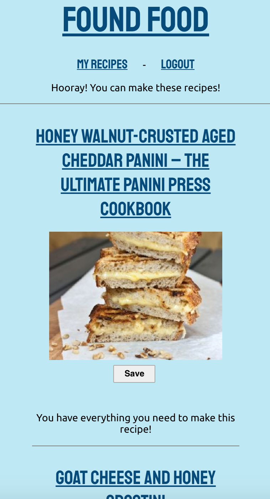
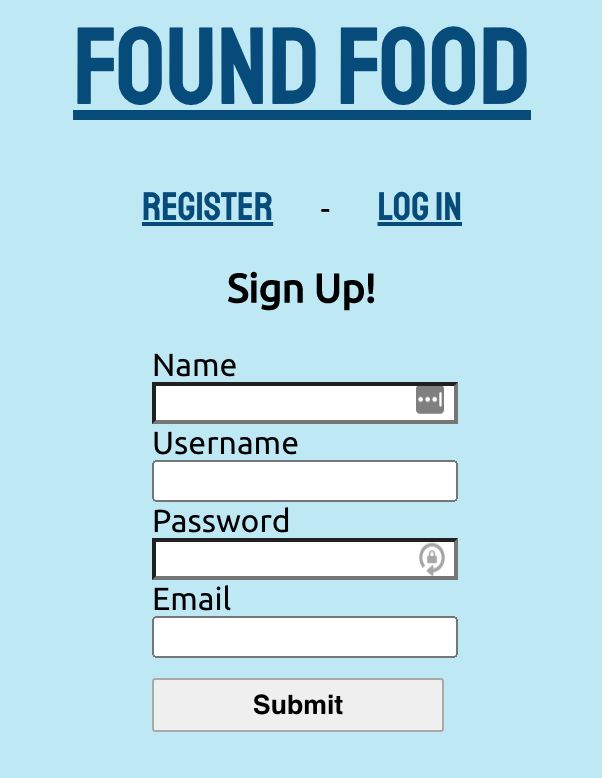
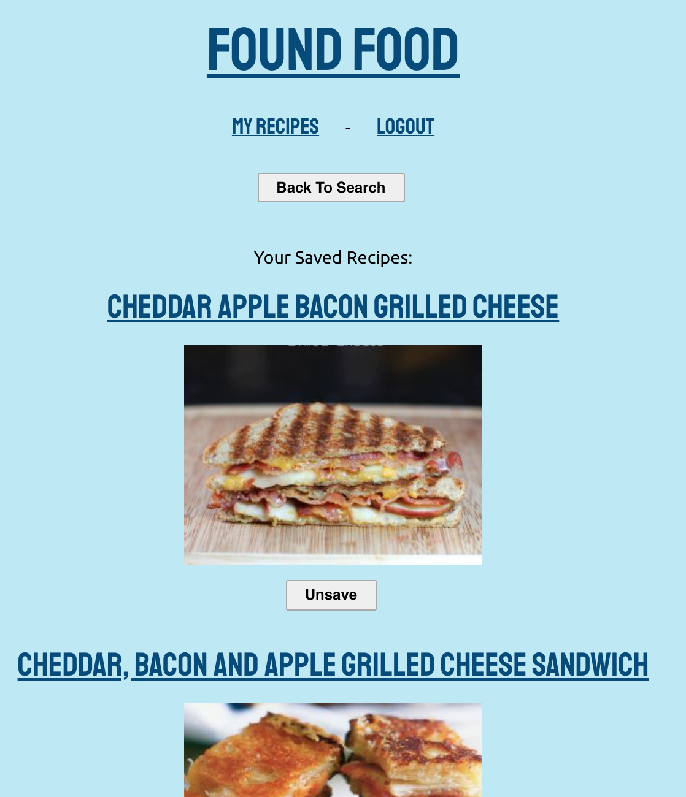

# Found Food

## A recipe search app

Search for recipes based off of food you already have in your kitchen!

https://found-food.conorkenahan.vercel.app/

### API Documentation

https://github.com/conorkenahan/found-food-api

Two tables are required- users and saved_recipes.

### Screenshots

Select the ingredients you have on hand from a list...

View a list of compatible recipes!

Register and login to save your favorite recipes.

View your saved recipes when logged in.

### Technology used

- React
- Express
- Node & Postgres
